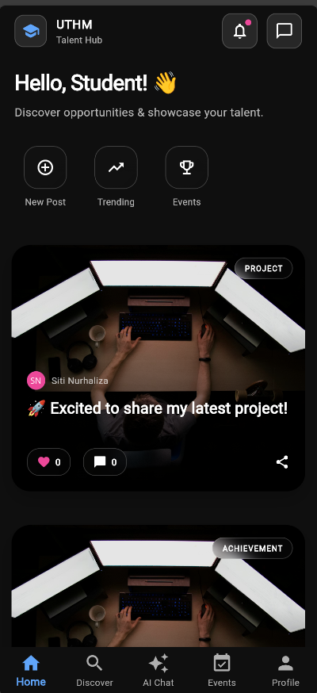
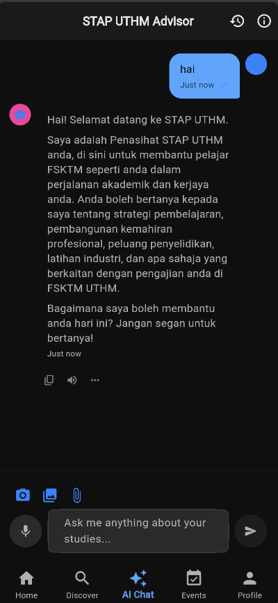
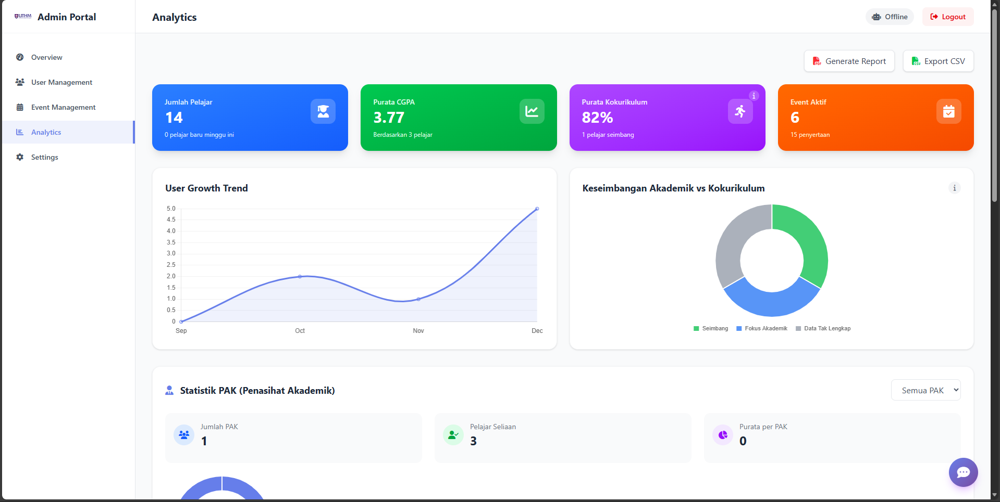

# Student Talent Profiling App


An end-to-end platform for profiling UTHM student talent. Students build a profile, showcase achievements, join events, and interact through a social feed. University admins get rich analytics and AI-powered insights through a dedicated web dashboard.

The AI assistant responds in **Bahasa Melayu** by default, with Gen Z-style conversational tone built for local students.

> **Security note:** this repository ships without secrets. Populate your own `.env` files before running any service. Never commit credentials.

---

## Agentic AI

The AI layer goes beyond a simple chatbot. It is built on **Google Gemini 2.5 Flash** with **LangChain and LangGraph**, giving it the ability to:

- **Converse in Bahasa Melayu** with natural, Gen Z-style responses tailored for Malaysian students
- **Call tools** to query the database, fetch student analytics, and retrieve faculty information
- **Remember context** across a conversation using built-in conversation memory
- **Route intelligently** between a fast direct mode and a full agentic mode depending on query complexity
- **Answer faculty questions** using RAG with UTHM knowledge base via Supabase pgvector

---

## Features

| Feature | Description | Status |
| :--- | :--- | :--- |
| Student Profile | Build a talent profile with skills, achievements, projects, and experiences | Production |
| Showcase Feed | Post and share achievements like a social feed | Production |
| Event Program | Browse, register, and track university events (kokurikulum) | Production |
| AI Assistant | Voice-enabled agentic chatbot in Bahasa Melayu with tool calling and memory | Production |
| Talent Quiz | Discover strengths through a guided quiz | Production |
| Intelligent Profiling | AI-powered risk assessment and talent analysis based on student activity, CGPA, and participation history | Beta |
| PDF Reports | Auto-generated achievement reports for departments | Production |

---

## Gallery

| Mobile (Home) | AI Chat | Web Dashboard |
| :---: | :---: | :---: |
|  |  |  |

---

## Repository Layout

```
student-talent-profiling-app/
├── backend/                # FastAPI backend, AI agents, ML analytics
├── mobile_app/             # Flutter mobile app (student-facing)
├── web_dashboard_astro/    # Admin dashboard (Astro v5, university-facing)
├── assets/                 # Branding assets
└── .github/workflows/      # CI/CD pipelines
```

---

## System Architecture

```
Supabase (Auth + PostgreSQL + pgvector)
            |
            v
     FastAPI Backend  <---  Agentic AI (Gemini + LangGraph + RAG)
      |           |
      v           v
Flutter Mobile   Astro Web Dashboard
(students)       (university admin)
```

---

## Stack

| Layer | Technology |
| :--- | :--- |
| Mobile | Flutter, Dart 3, Provider, Supabase Flutter SDK |
| Backend | FastAPI, SQLAlchemy, Alembic, PyJWT |
| AI | Google Gemini 2.5 Flash, LangChain, LangGraph, RAG via pgvector, fastembed |
| Dashboard | Astro v5, Tailwind v4, TypeScript, Chart.js |
| Database | Supabase (PostgreSQL + pgvector) |
| Media | Cloudinary |
| Payment | ToyyibPay |
| Deployment | Docker, Digital Ocean VPS, Vercel |

---

## Getting Started

### Backend

```bash
cd backend
cp .env.example .env   # fill in your values
python -m venv .venv
.venv\Scripts\activate  # Windows
pip install -r requirements.txt
python main.py          # http://localhost:8000
```

### Mobile App

```bash
cd mobile_app
cp assets/.env.example assets/.env   # fill in your values
flutter pub get
flutter run
```

### Web Dashboard

```bash
cd web_dashboard_astro
cp .env.example .env   # fill in your values
npm install
npm run dev            # http://localhost:4321
```

---

## Environment Variables

### Backend (`backend/.env`)

| Variable | Description |
| :--- | :--- |
| `DATABASE_URL` | Supabase PostgreSQL connection string |
| `SUPABASE_URL` | Supabase project URL |
| `SUPABASE_KEY` | Supabase anon key |
| `SUPABASE_SERVICE_KEY` | Supabase service role key |
| `SUPABASE_JWT_SECRET` | JWT secret (Project Settings > API) |
| `GEMINI_API_KEY` | Google Gemini API key |
| `CLOUDINARY_CLOUD_NAME` | Cloudinary cloud name |
| `CLOUDINARY_API_KEY` | Cloudinary API key |
| `CLOUDINARY_API_SECRET` | Cloudinary API secret |
| `ALLOWED_ORIGINS` | Comma-separated allowed CORS origins |

### Mobile App (`mobile_app/assets/.env`)

| Variable | Description |
| :--- | :--- |
| `SUPABASE_URL` | Supabase project URL |
| `SUPABASE_ANON_KEY` | Supabase anon key |
| `BACKEND_URL` | Deployed backend URL |
| `CLOUDINARY_CLOUD_NAME` | Cloudinary cloud name |

### Web Dashboard (`web_dashboard_astro/.env`)

| Variable | Description |
| :--- | :--- |
| `PUBLIC_SUPABASE_URL` | Supabase project URL |
| `PUBLIC_SUPABASE_ANON_KEY` | Supabase anon key |
| `PUBLIC_BACKEND_URL` | Deployed backend URL |

---

## License

MIT
